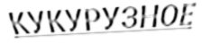
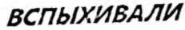

# Multi-OCR Pipeline for Russian Text Extraction

This project implements a multi-OCR pipeline for extracting Russian text from images. The pipeline utilizes multiple OCR models including OpenAI GPT-4o, Anthropic Claude 3.7, Google Gemini, and Deepseek Janus Pro. The performance of each model is evaluated by calculating the Character Error Rate (CER), which allows for a detailed comparison of the OCR models' effectiveness.

## Table of Contents
- [Installation](#installation)
- [Setup and Configuration](#setup-and-configuration)
- [Usage](#usage)
- [Models](#models)
- [Evaluation](#evaluation)
- [Results](#results)
- [License](#license)

## Installation

To run this project, you need to install the necessary dependencies. Use the following commands to set up your environment:

```bash
pip install openai google-genai anthropic requests pillow jiwer
pip install -U -q "google-generativeai>=0.8.3"
pip install --upgrade --quiet google-genai
pip install bitsandbytes transformers huggingface_hub
pip install git+https://github.com/deepseek-ai/Janus.git
pip install git+https://github.com/Dao-AILab/flash-attention.git

pip install pytesseract easyocr paddlepaddle paddleocr surya-ocr jiwer
pip install git+https://github.com/VikParuchuri/surya.git
pip install --upgrade opencv-python
```

Make sure to install any other dependencies as required for your setup.

## Setup and Configuration

### API Keys

Before running the project, you need to set up your API keys for the different OCR models. Replace the placeholders with your actual API keys:

- **OpenAI API Key**
- **Anthropic API Key**
- **Google API Key**

```python
ANTHROPIC_API_KEY = user_secrets.get_secret("ANTROPIC_API_KEY")
OPENAI_API_KEY = user_secrets.get_secret("OPENAI_API_KEY")
GOOGLE_API_KEY = user_secrets.get_secret("GOOGLE_API_KEY")
```

### Model Configuration

The project uses the following LLM models:
- **OpenAI GPT-4o** for OCR via GPT-4 with vision support.
- **Anthropic Claude 3.7** for OCR using the Claude Sonnet API.
- **Google Gemini 2.0 Flash** for OCR using Google's Gemini Flash model.
- **Deepseek Janus Pro** for OCR locally using the Janus model.

And polular OCR models:
- **Tesseract OCR** - An open-source OCR engine developed by Google, widely used for recognizing printed text in images.
- **EasyOCR** - A lightweight OCR library that supports multiple languages, including Russian, and leverages deep learning for text recognition.
- **PaddleOCR** - A deep learning-based OCR model from PaddlePaddle that supports over 80 languages, offering high accuracy for text extraction.
- **Surya OCR** - An advanced OCR tool utilizing cutting-edge techniques for text recognition in images, optimized for accuracy.

Each model has specific APIs and endpoints that are called to perform OCR on images.

## Usage

### Dataset 
I used 50 images from [OCR-Cyrillic-Printed-8](https://huggingface.co/datasets/DonkeySmall/OCR-Cyrillic-Printed-8)

### OCR Functions

The pipeline has functions for calling each model’s API. These functions process images and return the OCR results.

- `ocr_openai(image_path)`: Uses OpenAI GPT-4o API for OCR.
- `ocr_anthropic(image_path)`: Uses Anthropic Claude 3.7 Sonnet API for OCR.
- `ocr_google(image_path)`: Uses Google Gemini 2.0 Flash API for OCR.
- `ocr_deepseek(image_path)`: Uses Deepseek Janus Pro for local OCR.
- `ocr_tesseract(image_path)`: Uses Tesseract for local OCR.
- `ocr_easyocr(image_path)`: Uses EasyOCR for local OCR.
- `ocr_paddleocr(image_path)`: Uses PaddleOCR for local OCR.
- `ocr_surya(image_path)`: Uses SuryaOCR for local OCR.

### OCR Evaluation

The **Character Error Rate (CER)** is calculated using the `JiWER` library. It compares the ground truth text from the dataset with the predictions made by the OCR models.

```python
import jiwer
cer_score = jiwer.cer(true_text.strip().lower(), pred_text.strip().lower())
```

This evaluation helps compare the models' accuracy in extracting Russian text from images.

### Batch Processing

You can process a batch of images and compute the CER for each model's prediction. The results are stored in a CSV file:

```python
df_cer.to_csv("/kaggle/working/cer_results.csv", mode="w", index=False)
```

### Best and Worst Examples

The best and worst OCR results for each model are plotted, showcasing the image, the CER score, and the prediction.

```python
plot_best_worst_examples(df_cer)
```

### Example Workflow

1. Load and preprocess the dataset:
   - The dataset contains images of printed Russian text.
   - Each image is processed by the OCR functions.
   
2. Perform OCR with each model and compute CER:
   - For each image, the ground truth text and the model predictions are compared.
   
3. Save the evaluation results:
   - CER scores for all models are saved in a CSV file.

4. Visualize the best and worst OCR results.


## LLM Models

### OpenAI GPT-4o

- GPT-4 with vision support allows the extraction of text from images by sending requests to the OpenAI API.

### Anthropic Claude 3.7

- Claude is an advanced language model by Anthropic, capable of extracting text from images in the Russian language.

### Google Gemini 2.0 Flash

- Google’s Gemini 2.0 Flash is used for OCR tasks, leveraging Google’s cutting-edge generative models for image understanding.

### Deepseek Janus Pro

- Janus Pro is a multimodal model capable of processing images and answering questions related to the content of the images, such as text extraction.

## OCR Models

### Tesseract OCR
- [Tesseract](https://github.com/tesseract-ocr/tesseract) is a popular OCR engine that was used for recognizing Cyrillic text. The code to use Tesseract is as follows:

### EasyOCR
- [EasyOCR](https://github.com/JaidedAI/EasyOCR) is another OCR library that supports various languages, including Russian. The function for using EasyOCR is:

### PaddleOCR
- [PaddleOCR](https://github.com/PaddlePaddle/PaddleOCR) is a deep learning-based OCR model that supports over 80 languages, including Russian. The PaddleOCR function used is:

### Surya OCR
- [Surya OCR](https://github.com/VikParuchuri/surya) leverages advanced techniques for text recognition. Here’s the code to use SuryaOCR:

## Evaluation

The performance of each OCR model is evaluated based on the **Character Error Rate (CER)**. The lower the CER, the more accurate the OCR output is. A visual representation of the best and worst OCR results is also provided.

### Results

The evaluation results are stored in a CSV file, which contains the following columns:
- **Model**: The OCR model used.
- **Image**: The path to the image.
- **CER**: The Character Error Rate.
- **Reference**: The ground truth text.
- **Prediction**: The OCR model's output.

**Images where the majority of models made mistakes**:
These images contained challenging conditions for OCR: blurred characters, low contrast, compression artifacts.


**Images that all models recognized without errors**:
Good contrast, clear font, and the absence of interference made the text understandable for all models.


**Images where LLMs outperformed OCR**:
LLMs, especially GPT-4o and Gemini 2.0 Flash, were able to handle texts where OCR made mistakes, such as:
GPT-4o - "ВСПЫХИВАЛИ" (0% CER)
EasyOCR - "ВСПЫХИБАЛИ" (10% CER)


## License

This project is licensed under the MIT License - see the [LICENSE](LICENSE) file for details.
